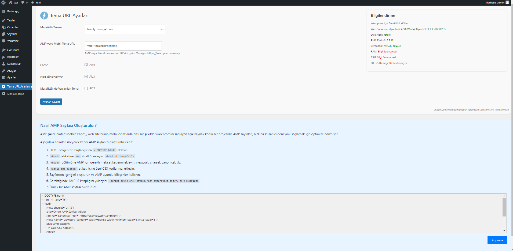

Özel Tema URL Yönlendirme Eklentisi

Bu WordPress eklentisi, masaüstü ve mobil cihazlar için farklı temalar belirlemenize olanak tanır. Ayrıca, AMP sayfaları için özel bir URL belirleyebilirsiniz.

Özellikler:

Masaüstü ve mobil cihazlar için farklı temalar belirleme.
AMP sayfaları için özel bir URL belirleme.
Yönlendirme hızı ayarı ile hızlı yönlendirme seçeneği.
URL'yi masaüstü sürüme gizleme seçeneği.

Kurulum:

WordPress sitenize giriş yapın ve Yönetici Paneli'ne gidin.
Eklentiler sekmesine tıklayın ve "Yeni Ekle" yi seçin.
"Özel Tema URL Yönlendirme Eklentisi" zipten yükleyin
Eklentiyi kurun ve etkinleştirin.

Kullanım:

Yönetici Paneli'nde "Tema URL Ayarları" sayfasına gidin.
Masaüstü temanızı seçin ve AMP veya mobil tema için özel URL'yi belirleyin.
Gerekirse, diğer seçenekleri yapılandırın (örneğin, hızlı yönlendirme, URL'yi masaüstü sürümüne gizleme).
Ayarları kaydedin ve değişikliklerin etkili olması için sitenizi yenileyin.

